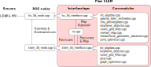

# plain_slam_ros2

**plain_slam_ros2** is a ROS 2 package for LIO, LiDAR SLAM, and localization, built upon a minimal and modular SLAM system. The implementation is concise - its core C++ source code contains fewer than **1,800 lines**.

Despite its simplicity, **plain_slam_ros2** provides the following key features:

- Both loosely and tightly coupled approaches for LIO
- Loop detection based on GICP
- Pose graph optimization for global consistency
- Point-cloud-map-based localization using the same approaches as LIO

The core SLAM logic is independent of ROS 2 and relies only on **Sophus** (which in turn depends on **Eigen**), **nanoflann**, and **YAML** (used for parameter loading).


**LIO (Localization) example**

The white points represent the local map used in LIO. When operating in localization mode, this can correspond to the global map.

<video src="movies/lio_example.mp4" autoplay loop muted playsinline></video>

**SLAM example**

<video src="movies/slam_example.mp4" autoplay loop muted playsinline></video>


## Install

**Note:** This package has been tested on **Ubuntu 22.04** with **ROS 2 Humble**.

**YAML and Eigen**

```sh
sudo apt update
sudo apt install libyaml-cpp-dev
sudo apt install libeigen3-dev
```

**nanoflann**

```sh
git clone https://github.com/jlblancoc/nanoflann.git
sudo cp -r nanoflann/include/nanoflann.hpp /usr/local/include/
```

**Sophus**

```sh
git clone https://github.com/strasdat/Sophus.git
cd Sophus
mkdir build && cd build
cmake ..
make -j$(nproc)
sudo make install
```

**plain_slam_ros2**

```sh
cd your/ros2_ws/src/
git clone https://github.com/NaokiAkai/plain_slam_ros2.git
cd your/ros2_ws/
colcon build
source install/setup.bash
```


## How to use

**LIO**

Please edit `config/lio_3d_config.yaml` to match your environment. Then, launch `lio_3d.launch.py`. Don't forget to run `colcon build` after editing the config files.

```sh
ros2 launch plain_slam_ros2 lio_3d.launch
rviz2 -d config/lio_3d.rviz
```

**SLAM**

Please edit `config/slam_3d_config.yaml` to match your environment as well. Then, launch `slam_3d.launch.py`.

```sh
ros2 launch plain_slam_ros2 slam_3d.launch
rviz2 -d config/slam_3d.rviz
```

**Note:** To use SLAM, make sure that `use_as_localizer` in `config/lio_3d_config.yaml` is set to `false`.

**Localization**

**plain_slam_ros2** does not depend on PCL, but it can load and save `.pcd` files. We assume your `.pcd` files are located in `/tmp/pslam_data/` (the default setting).
To use the system as a localizer, set `use_as_localizer: true` in `config/lio_3d_config.yaml`, and set `map_cloud_dir` to the directory containing your `.pcd` files. Then, launch `lio_3d.launch.py`.


# Overview



The main source files of Plain SLAM consist of an **interface layer** and **core modules**, as shown in the overview figure. The total implementation of Plain SLAM is less than 1,800 lines of code.


## License

**plain_slam_ros2** is publicly available software, provided free of charge for academic and personal use only. Commercial use is not permitted without prior written permission from the author. See [LICENSE.txt](./LICENSE.txt) for full terms.
